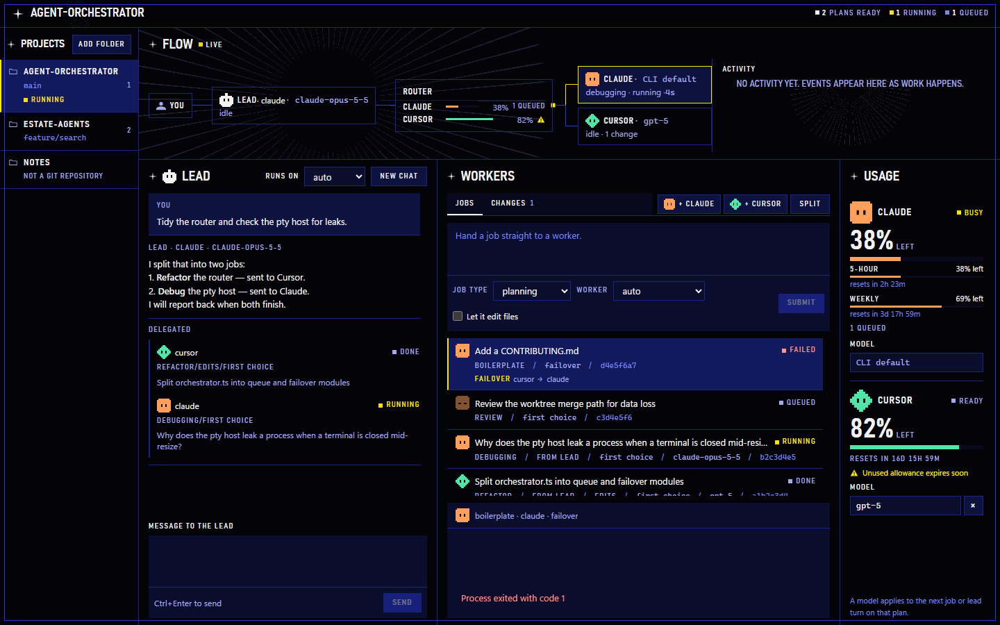
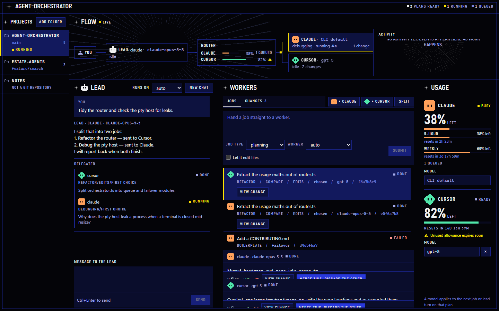
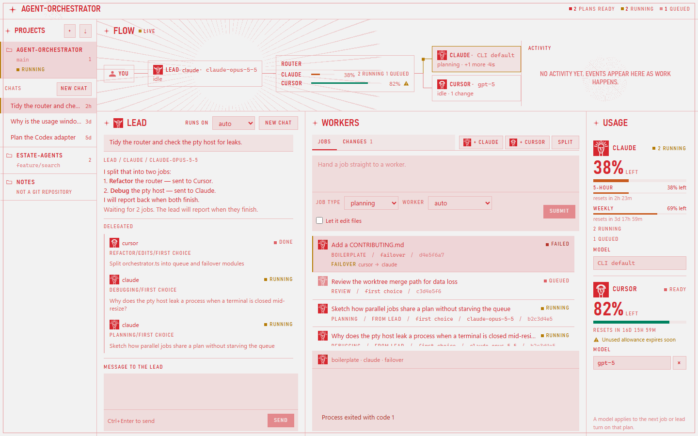

# agent-orchestrator

A desktop app (Electron + TypeScript) that spreads your coding jobs across the AI subscriptions you already pay for, so no plan sits idle or runs out early.



| Compare two plans side by side                                                  | Light mode                                                         |
| ------------------------------------------------------------------------------- | ------------------------------------------------------------------ |
|  |  |

The screenshots use fake data and are made with `pnpm shots`. The app has seven looks, chosen in the header.

**Status:** 1.0.0, Windows only. Everything below is unit-tested. Checked against the real CLIs: an editing job on Cursor from start to merge, and the terminals on both plans. The lead chat and Claude jobs have had little real use so far. See [BACKLOG.md](BACKLOG.md) for what is next.

## How it works

- **Lead chat.** You talk to one lead bot. It splits your request into jobs and hands them to workers, and you can keep talking to it while they run. When they finish it reports back. The lead is an ordinary CLI session that can only call the app's own tools.
  Each reply lists the jobs it handed out: which worker got it, why, and how it is going.
- **Saved chats and jobs.** Conversations and the job list are kept per project in a local SQLite file, and past chats are listed in the sidebar.
- **Terminals.** Open a full Claude or Cursor session in a tab and talk to it directly. Open tabs come back after a restart with their conversation; a tab that cannot resume starts a new session. Turn on Worktree to start a session in its own git worktree, or open one from Changes.
- **Projects.** A sidebar lists the folders you work in. One is active at a time; jobs and the lead run there. If the GitHub CLI (`gh`) is signed in, you can also clone one of your repos as a project.
- **Workers.** You can also hand a job straight to a worker and pick its type (planning, debugging, review, refactor, boilerplate) and its access (Read only, Edit files, or Full access). Each plan runs up to three jobs at once, and a job can be stopped. Full access runs commands without asking, still in a worktree; only use it in folders you trust.
- **Steps.** Every file a worker reads or edits and every command it runs is listed live under its job, with the diff of each edited file.
- **Compare.** Choose "both (compare)" as the worker to send the same prompt to both plans, read the results side by side, and merge one change while discarding the other.
- **Changes.** A job allowed to edit files works in its own git worktree. You review the diff, then merge it as staged changes or discard it. After a merge, you can open a pull request from those staged changes. A worktree with an open terminal shows even before any files change, and you can open Claude or Cursor there.
- **Router.** A rule table plus how much allowance each plan has left picks the provider. Claude's headroom comes from the usage figure its CLI reports.
- **Adapters.** The app spawns each provider's official CLI headless (`claude -p`, `agent -p`) and reads its `stream-json` output.
- **Failover.** If a plan reports a limit error, it is marked resting and its queued jobs move to the other plan.
- **Usage meter.** The window shows how much allowance each plan has left, and says what to run when a CLI is missing or signed out. The app works with only one of the two plans.

Everything runs locally, per person. There is no server.

## The MCP bridge

The lead reaches the app through a small MCP server inside the main process, with four tools: `list_workers`, `send_job`, `get_status` and `get_result`. It listens on loopback only, requires a random token that changes every start, and refuses requests that carry a browser `Origin`.

## Subscription use

- It runs the unmodified official CLIs, each signed in by you with your own plan.
- It never reads, stores or forwards login tokens or session credentials.
- It does not use any Agent SDK and makes no pay-per-token API calls.
- Jobs are started by a person, not on a timer.

You are responsible for staying within each provider's terms.

## Security

- Everyone uses their own plans. The app has no accounts, no server and no way to reach anyone else's login.
- The window is sandboxed, cannot navigate away from the app, and reaches the main process only through a fixed list of functions.
- A worker is Read only, Edit files, or Full access. Read only cannot change files. Edit files writes inside its own git worktree and cannot run shell commands. Full access writes in that same worktree and runs commands without asking; use it only in folders you trust.
  - Claude workers never get your own MCP servers. Read only and Edit files deny the shell, and deny writes unless the job may edit. Full access uses bypassPermissions. This holds whatever your own Claude settings allow.
  - Cursor Read only and Edit files jobs are started without `--force`; an Edit files job gets a permission file that denies the shell. Full access passes `--force` and does not write that file. Rules in your own Cursor CLI config, or a `.cursor/cli.json` in the project, still apply.
- Only add or clone folders you trust. A project can carry its own Claude Code or Cursor settings, including hooks that run commands when an agent works there.
- The terminals are full CLI sessions; what they may do is whatever you approve inside them.

## Install

Download the `-setup.exe` from [GitHub Releases](https://github.com/scholtzdaniel10/agent-orchestrator/releases). Windows only for now. Windows SmartScreen will warn because the installer is not signed: click **More info**, then **Run anyway**. You need the `claude` and/or Cursor `agent` CLI installed and signed in. Updates download in the background and install themselves when you quit.

## Develop

Requires Node 22+ and pnpm.

```bash
pnpm install
pnpm dev           # run the app
pnpm test          # unit tests, no real CLIs
pnpm build         # typecheck + build
pnpm shots         # screenshots of the UI with fake data, in .orchestrator/shots/
pnpm build:win     # the Windows installer, in dist/
pnpm gate router   # acceptance: 10 real jobs + one forced failover
pnpm gate lead     # acceptance: the lead splits a two-part request across both plans
pnpm gate worktrees   # acceptance: an editing job merges cleanly (GATE_WORKERS=cursor for one plan)
```

The `gate` commands use your real plans and spend real allowance.

| Variable         | Effect                                                                               |
| ---------------- | ------------------------------------------------------------------------------------ |
| `ORCH_CWD`       | Folder the jobs run in (default: where the app was started)                          |
| `ORCH_RULES`     | Path to your own edited copy of `src/core/router/rules.json`                         |
| `ORCH_LEAD`      | `claude` or `cursor` to choose the lead's plan (default: the one with more headroom) |
| `ORCH_NO_UPDATE` | `1` stops an installed build from checking GitHub Releases for updates               |

Usage is stored locally with Node's built-in `node:sqlite`, so there is no native module to rebuild.

### Release

Bump `"version"` in `package.json`, tag `vX.Y.Z`, and push the tag. That builds a draft GitHub Release with the Windows installer; publish the draft when you are ready.

## Tested with

- Claude Code `2.1.258`
- Cursor CLI `2026.10.01-e373342`

Newer CLI versions usually work; the app tells you when one sends output it does not understand.

## License

MIT
